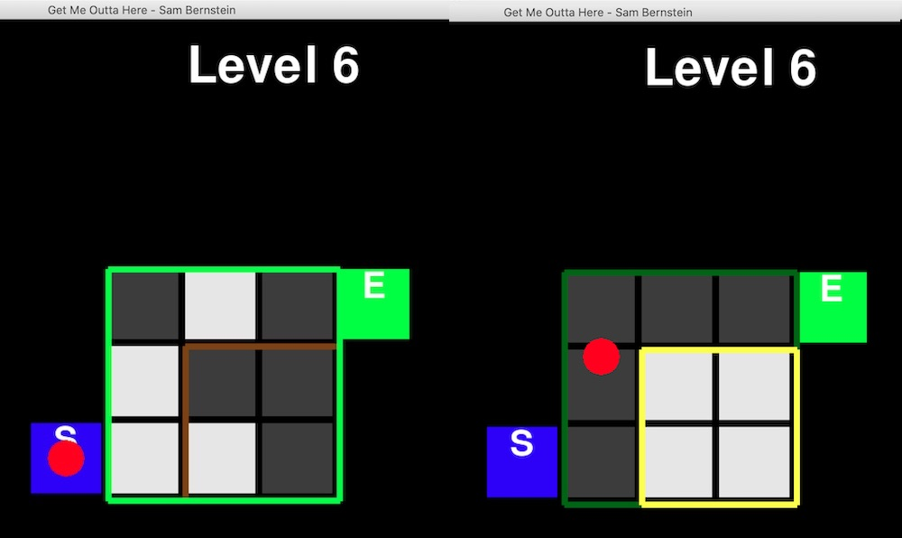
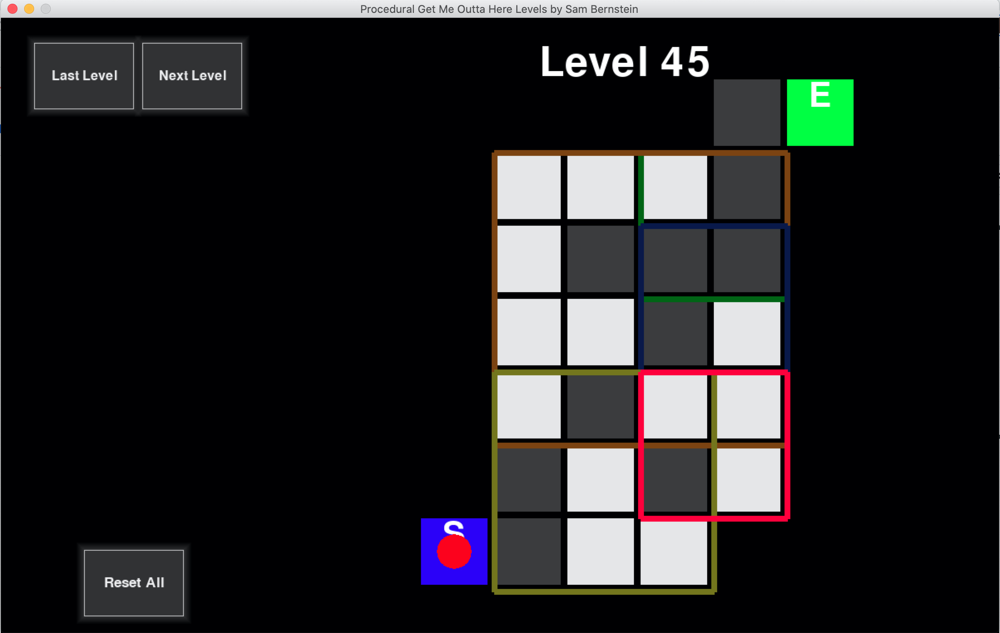

# Get-Me-Outta-Here
A puzzle game where every level is a cross between a maze and a 2D Rubik's cube. Every tile in the grid is empty or has a block. The grid contains square subregions you can rotate 90º, and all the blocks will rotate with that square. Rotate different squares to rearrange the grid to open up a path from your start tile to the end tile and solve the maze.

Run from the command line with Python 2 and the package `pygame` version `1.9.6` installed.

Start out by running `python2 Initiative_Game.py` from the `/game` directory for 17 handcrafted levels and instructions for how to play.

Run `python2 Procedural_Initiative_Game.py` from the `/game` directory for 50 procedurally generated levels that get progressively harder. Re-running the script will generate a new set of 50 levels. Repeat for endless fun. I find these levels are actually more fun than the 17 levels I handcrafted in `Initiative_Game.py`.

Reason strategically about how to solve each level. Look for invariants (Are there any tiles I can't move?). Use logical deduction (How many empty tiles are there, and how many empty tiles do I need to make a path through the level?). Try to build blocks and tuck them away from the path you are trying to open up.

